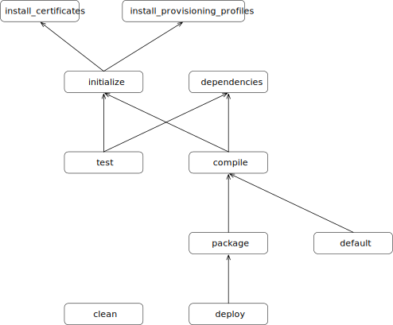

# xcodebuild

Xcodebuild is a Ruby gem that implements a [rake](https://github.com/ruby/rake) task library for building Xcode projects.

**Warning**: this project is unsupported, not under active development, and not intended for a general audience. I’m not a Ruby developer, so this project contains bad Ruby code, and there are probably better projects out there that accomplish similar things (for example, [fastlane](https://fastlane.tools) and [xcbuild](https://github.com/facebook/xcbuild)).

## Usage

### Prerequisites

- Ruby. Ruby comes preinstalled on macOS, but it’s recommended to use [rbenv](https://github.com/rbenv/rbenv) or [RVM](https://rvm.io) to manage Ruby versions.
- [Bundler](https://bundler.io). Once you have your preferred Ruby interpreter setup, run  `gem install bundler`.

## Configuring

To use Xcodebuild in a project:

1. Create a Gemfile. This should contain something like this:

   ```ruby
   ruby '2.4.2'
   source 'https://rubygems.org'
   
   git_source(:github) { |repo_name| "git@github.com:#{repo_name}.git" }
   
   gem 'xcodebuild', :github => 'toddreed/xcodebuild'
   gem 'cocoapods'
   ```

2. Run `bundle install` to install the dependencies.

3. Add `Gemfile` and `Gemfile.lock` to your project’s Git repository:

   ```sh
   git add Gemfile Gemfile.lock
   ```

4. Create a Rakefile; this could be as simple as:

   ```ruby
   require 'rake'
   require 'xcodebuild'
   
   project = XcodeBuild::BuildProject.load('build.yml)
   XcodeBuild::Tasks.new(project)
   ```

5. Create a YAML file that describes your build configuration:

   ```yaml
   workspace: Foo.xcworkspace
   certificate: Distribution.p12
   
   builds:
     - scheme: Foo
       provisioning_profile: Foo App Store
       export_options_plist: ExportOptions.plist
       app_id: 999999999
   ```

6. Define necessary environment variables. See below for details.

7. Run, for example, `bundle exec rake package`. To see a list of tasks, run `bundle exec rake -T`.

### Environment Variables

| Variable                     | Description                                                  | Default    |
| ---------------------------- | ------------------------------------------------------------ | ---------- |
| `BUILD_NUMBER`               | The build number passed to `xcodebuild` (the Xcode command line tool, not this library) and assigned to the `BUILD_NUMBER` build setting of your Xcode project. This assumes that you have a user-defined build setting named `BUILD_NUMBER` in your Xcode project, and that in your `Info.plist` file you assign the Bundle version property (`CFBundleVersion`) to `${BUILD_NUMBER}`. | yyyy.ddd.0 |
| `DEVELOPER_DIR`              | Controls the version of Xcode tools used.                    |            |
| `APP_STORE_CONNECT_USER`     | The Apple ID for an App Store Connect account with the Developer role used to upload builds. This is only used for the `deploy` task that uploads the `.ipa` file to TestFlight. |            |
| `APP_STORE_CONNECT_PASSWORD` | The password for the above Apple ID account.                 |            |
| `CERTIFICATE_PASSWORD`       | The password use for `.p12` certificates. Currently it is assumed that all certificates have the same password. This is only used when running in a CI environment; otherwise, it is assumed that the necessary certificates (and provisioning profiles) are on the developer’s machine. |            |

## Build Projects

A *build project* is a description of what you want to build. It specifies the Xcode project or workspace, the scheme and configuration to use, and other build settings and metadata needed to create an `.xcarchive` or `.ipa` file. There are two ways to specifying your build project: with a YAML file, or with Ruby code in your Rakefile.

A build project is has the following model:


## Tasks

The tasks and their dependencies:




The `package` tasks creates an `.xcarchive`, and the `deploy` tasks uploads to App Store Connect (TestFlight).

The `install_certificates` and `install_provisioning_profiles` tasks are no-ops when performed on a developer’s machine. This is determined by the existence of any environment variables that indicate that rake is running in a CI environment (e.g. `CI`, `TRAVIS`, or `TF_BUILD`). On a developer’s machine, it is assumed that the necessary certificates are in the login keychain and the requisite provisioning profiles are present in `~/Library/MobileDevice/Provisioning Profiles`.

## License

The gem is available as open source under the terms of the [MIT License](http://opensource.org/licenses/MIT).


